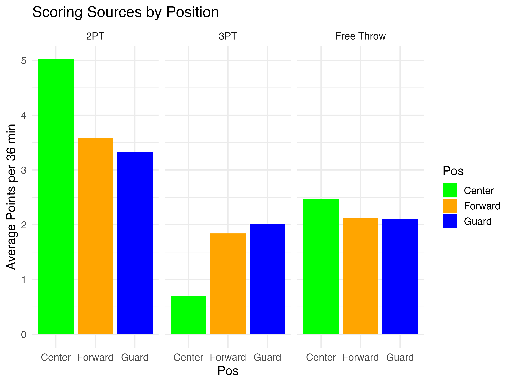
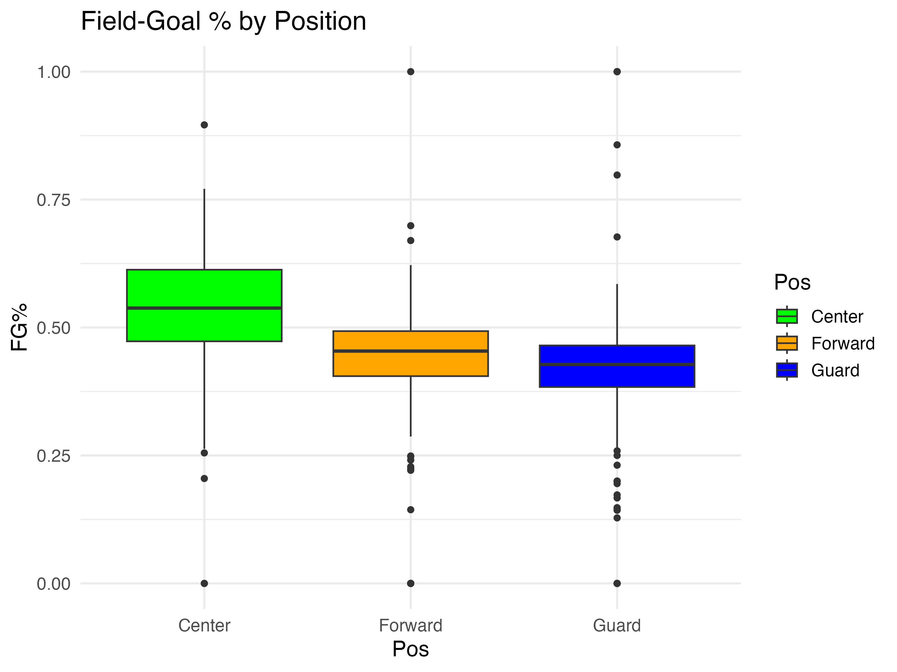
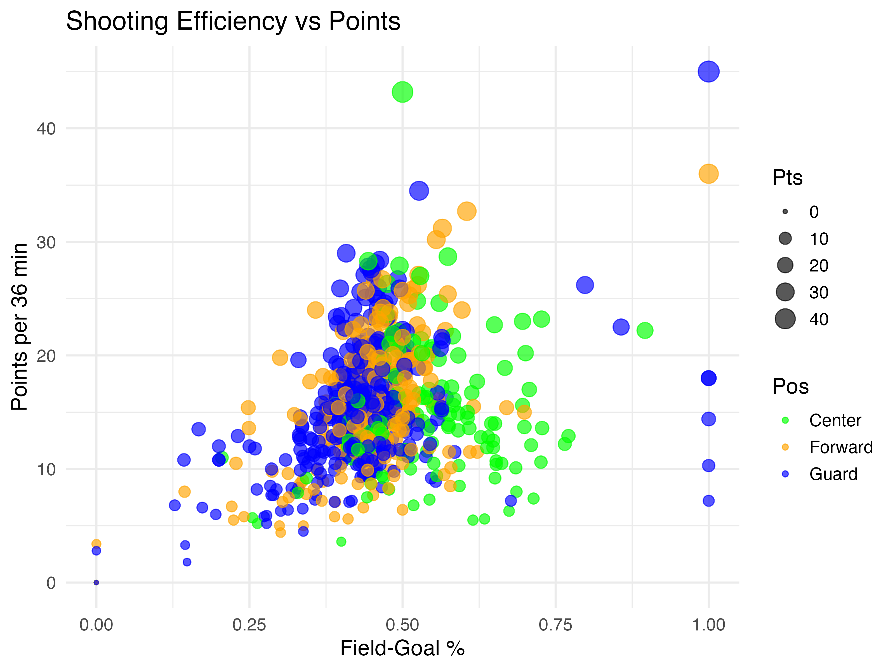

```{r, set-chunk-opts, echo = FALSE, eval = TRUE}
library(knitr)
opts_chunk$set(
  echo = FALSE, warning = FALSE, message = FALSE
)
```

# Introduction
This report examines per‑36‑minute NBA player statistics (as of March 7, 2025). It covers:

1. Data cleaning and preparation
2. Scoring analysis by position
3. Defensive and rebounding metrics
4. Age and experience relationships
5. Team potential ranking

Scripts are located in `Code/`, and all outputs are written to `Output/`.


# Data Analysis

## Coder1:


## Coder2: Scoring analysis by position
We compared how guards, forwards, and centers generate their points and how efficient they are.

<div style="page-break-after:always"></div>

### 2.1 Sources of points  


```{r barplot-sources, fig.align="center"}

```


Centers score most of their points through 2-point field goals and free throws, with almost no reliance on three-pointers. Forwards exhibit a more balanced distribution, contributing across all three scoring methods. Guards rely heavily on three-pointers, with a notable drop in 2-point scoring compared to centers. This breakdown reflects each position’s typical playstyle, with centers dominating inside the paint and guards operating from the perimeter.

### 2.2 Shooting‑percentage distribution  
```{r}

```


Centers demonstrate the highest median field goal percentage, along with the widest range of efficiency. This is consistent with their shot selection, which tends to be closer to the basket. Forwards and guards show lower medians and tighter distributions, suggesting greater variability and more difficult shot attempts, particularly for guards who often shoot from distance.

### 2.3 Efficiency versus scoring volume  
```{r}

```

This scatter plot shows how field-goal percentage relates to scoring volume for players across positions. Most high-volume scorers with strong efficiency are guards (blue), confirming their central offensive roles. Centers (green) tend to be more efficient but with lower usage, reflecting their role as finishers. Forwards (orange) are spread throughout, showing their versatility. Larger dots (representing higher PTS) cluster around 0.5 FG%, reinforcing that elite scorers often balance shot volume with efficiency.


## Coder3:


## Coder4:


## Coder 5: Identifying top 5 potential NBA teams
Based on the analysis for individual players, we can now conduct data analysis at the team level. Upon reviewing the original dataset, we observe that our NBA dataset includes player-level statistics, such as:

1. Youth (Age): Represented by the "Age" column.

2. Scoring Efficiency: Represented by FG%, 3P%, FT%, or PTS.

3. Defensive Ability: Estimated using STL, BLK, and DRB.

By assigning weights to each of these categories—Youth (40%), Scoring Efficiency (30%), and Defensive Ability (30%)—we can calculate the Potential_Score for each team. This allows us to determine the top 6 teams with the highest potential.

Here are the results:

```{r, table-top6_teams_table}
table_one <- readRDS(
  file = here::here("Output/top6_teams_table.rds")
)
table_one
```

We also generate radar plots for these 6 teams using a 9-dimension profile: Youth (inverse age), FG% (Field Goal %), 3P% (Three Point %), FT% (Free Throw %), PTS (Points per game), STL (Steals), BLK (Blocks) and DRB (Defensive rebounds).

```{r, radar-plot}
#| fig.align = "center",
knitr::include_graphics(
  here::here("Output/top6_team_radar_grid.png")
)
```
#Discussion


